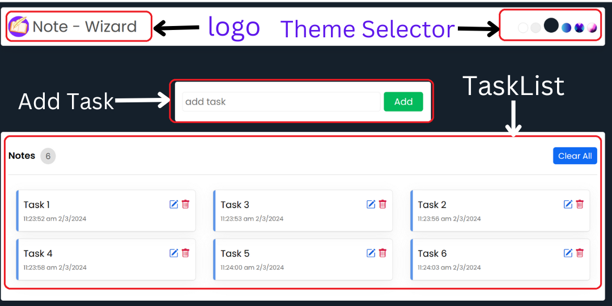

# Note-Wizard

This a Note taking App which stores the Data in Local Storage. It's HomePage Looks like this:  
 

# Features

1. Allows user to **Add Notes** which is stored in Local Storage of the browser.
2. Allows user to **Update Notes**.
3. Allows user to **Delete Notes**.
4. Allows user to **View the Notes** which were added.
5. Allows user to **Clear All** the Notes.
6. Allows user to **Change the background theme** based on the options provided in the Theme Selector.

# Note-Wizard Structure

# How to use this App?

-   Clone this Repo.
-   Install the npm dependencies using `npm install`
-   Run the React App using `npm start`
